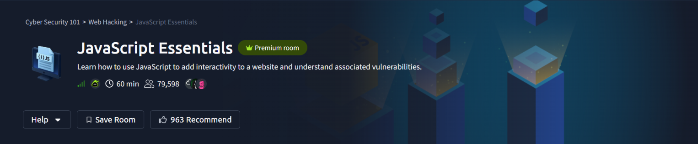
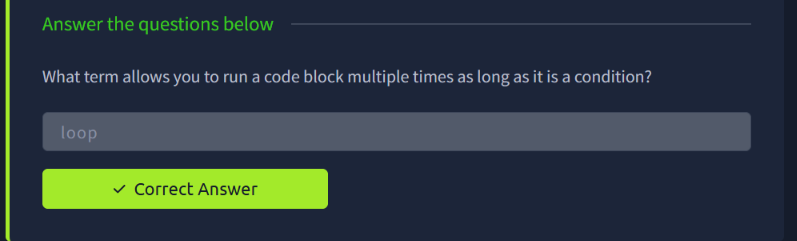
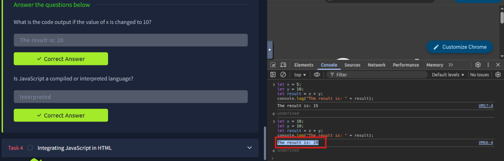
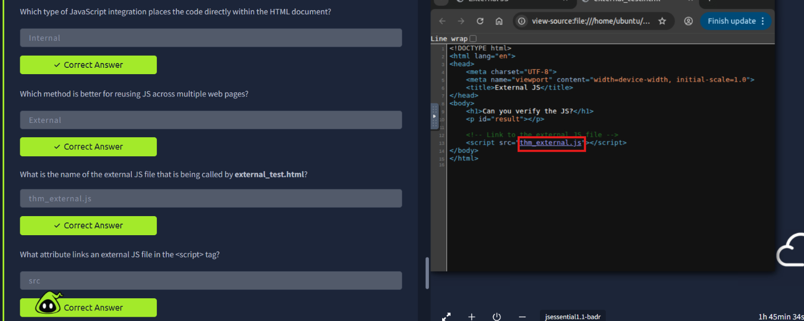
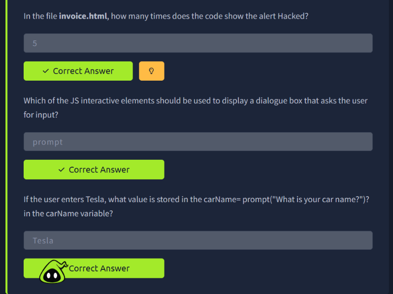
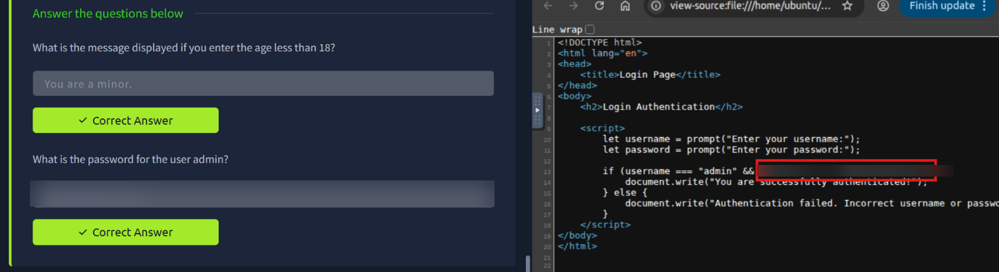
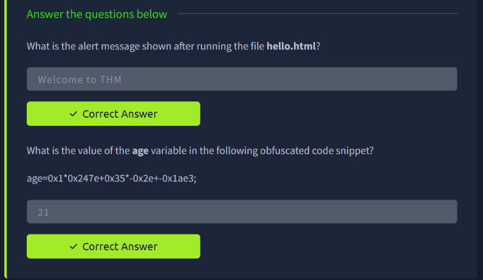
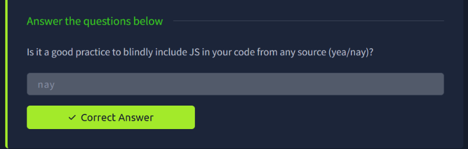

# TryHackMe — JavaScript Essentials

> **Track:** Cyber Security 101 → Web Hacking
> **Difficulty:** Easy · **Time:** ~60 min
> **Focus:** JavaScript fundamentals, DOM interaction, script integration, and why "just trusting" client-side JS is dangerous



Every dynamic behaviour on a webpage — validation, pop-ups, redirects, "logic" — is JavaScript running in the browser, in front of the user. This room walks through the language basics and then proves the point that matters most for security: if the logic lives in the browser, the user can read it, and often break it.

---

## Table of Contents
1. [Core Concepts: Loops](#1-core-concepts-loops)
2. [Variables and the Console](#2-variables-and-the-console)
3. [Integrating JavaScript in HTML](#3-integrating-javascript-in-html)
4. [Interactive Elements: alert, prompt, confirm](#4-interactive-elements-alert-prompt-confirm)
5. [Client-Side "Authentication" Is Not Authentication](#5-client-side-authentication-is-not-authentication)
6. [Reading Obfuscated JavaScript](#6-reading-obfuscated-javascript)
7. [Key Takeaways](#7-key-takeaways)

---

## 1. Core Concepts: Loops

The room opens with core language building blocks. A **loop** is what lets a block of code run repeatedly as long as a condition holds — the mechanism behind processing lists, repeating checks, or brute-forcing input.



---

## 2. Variables and the Console

JavaScript variables (`let`, `var`, `const`) hold values that can change during execution. The browser's **Developer Console** is the single most useful tool for a web-focused hacker: it lets you run arbitrary JS directly in the context of the page you're looking at.

```javascript
let x = 5;
let y = 10;
let result = x + y;
console.log("The result is: " + result);
// The result is: 15
```

Changing `x` to `10` and re-running:

```javascript
let x = 10;
let y = 10;
let result = x + y;
console.log("The result is: " + result);
// The result is: 20
```

The room also confirms a fact worth remembering: **JavaScript is interpreted**, not compiled — it's executed line by line by the browser's JS engine, which is exactly why you can paste new code into the console and watch it run instantly.



---

## 3. Integrating JavaScript in HTML

There are two ways to attach JS to a page, and the difference matters for both development and reconnaissance:

- **Internal**: JS written directly inside a `<script>` block in the HTML document.
- **External**: JS kept in its own `.js` file and linked in with the `src` attribute — the better choice for reusing code across multiple pages.

```html
<!-- Link to the external JS file -->
<script src="thm_external.js"></script>
```

Viewing the page source of `external_test.html` shows exactly which file is being pulled in — here, `thm_external.js`. This is a basic but important recon step: **view-source** and the **Sources** tab in DevTools reveal every script a page loads, internal or external.



---

## 4. Interactive Elements: alert, prompt, confirm

JavaScript ships three built-in dialog functions:

| Function | Purpose |
|---|---|
| `alert()` | Shows a message to the user |
| `prompt()` | Asks the user for input and returns it as a string |
| `confirm()` | Asks a yes/no question, returns a boolean |

In `invoice.html`, the code triggers the `alert("Hacked")` call **5 times** — a simple demonstration of how a loop or repeated calls can spam dialogs (the same primitive behind some denial-of-service-style annoyances in vulnerable pages).

For input capture:

```javascript
let carName = prompt("What is your car name?");
// User enters: Tesla
// carName === "Tesla"
```

Whatever the user types into a `prompt()` is stored verbatim in the variable — no validation applied unless the developer adds it.



---

## 5. Client-Side "Authentication" Is Not Authentication

This is the core security lesson of the room. The task provides a login page whose entire "authentication" logic is written in plain, readable client-side JavaScript:

```javascript
let username = prompt("Enter your username:");
let password = prompt("Enter your password:");

if (username === "admin" && password === "[REDACTED]") {
    document.write("You are successfully authenticated!");
} else {
    document.write("Authentication failed. Incorrect username or password");
}
```

Because this check runs entirely in the browser, **anyone can open view-source or DevTools and read the hardcoded credential directly** — no brute-forcing, no guessing, just reading the code. The room also demonstrates a related logic branch: entering an age under 18 returns the message `You are a minor.`, another condition sitting in plain sight in the client-side script.



> Credential redacted — the technique (view-source → read the conditional) is what matters, not the literal password.

**Why this matters in the real world:** any security-relevant decision — login checks, price validation, access control — must be enforced server-side. If it only exists in JavaScript the browser downloads, it's not a control, it's a suggestion.

---

## 6. Reading Obfuscated JavaScript

Not all client-side JS is this readable. Developers (and attackers hiding malicious scripts) obfuscate code to slow down manual analysis. The room's example:

```javascript
age = 0x1*0x247e+0x35*-0x2e+-0x1ae3;
```

Working through the hex arithmetic:
- `0x1 * 0x247e` = `9342`
- `0x35 * -0x2e` = `53 * -46` = `-2438`
- `-0x1ae3` = `-6883`

`9342 - 2438 - 6883 = 21`

So `age = 21`. The lesson: obfuscation only hides *readability*, not *execution* — the browser console (or a quick manual evaluation) decodes it just as easily as it runs it. A simple `hello.html` test file in the same task confirms basic script execution, popping an alert reading `Welcome to THM`.



---

## 7. Key Takeaways

- **The console is a hacking tool**, not just a debug tool — every variable, function, and piece of logic on a page is inspectable and executable there.
- **View-source and DevTools → Sources** reveal every script a page depends on, internal or external.
- **Never trust client-side logic for security decisions.** Login checks, age gates, and validation done only in JS can be read or bypassed by anyone who opens the browser tools.
- **Obfuscation is not protection.** It raises the reading effort slightly; it does not stop analysis.
- The room's own closing question sums it up: it is **not good practice to blindly include JS in your code from any source** — a third-party or untrusted script has the same access to the page as code you wrote yourself.



---

*Room completed on 24 September 2026 as part of the Cyber Security 101 path.*
